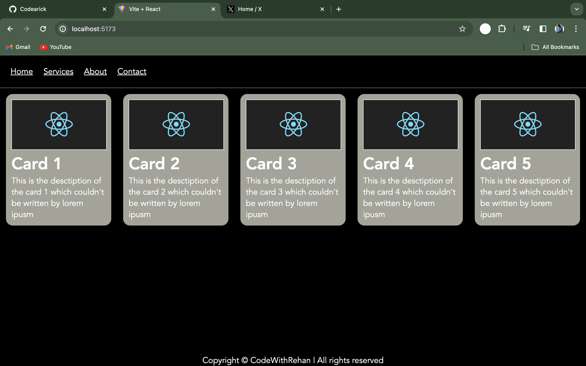

# Basic React Page

This repository contains a basic React page created as part of my learning journey. The page consists of a Navbar, Footer, and multiple Cards.

## Components

### Navbar

The Navbar component provides navigation links for the page.

#### Definition:
A Navbar component is a user interface element that typically appears at the top of a webpage and contains navigation links or menus to navigate the website.

#### Purpose:
The Navbar component provides easy navigation for users to move between different sections or pages of the website, enhancing user experience and accessibility.

### Footer

The Footer component displays footer information at the bottom of the page.

#### Definition:
A Footer component is a user interface element that appears at the bottom of a webpage and usually contains information such as copyright notices, contact details, or links to important pages.

#### Purpose:
The Footer component provides additional information or links relevant to the website and serves as a visual endpoint for the webpage, completing the layout and enhancing usability.

### Card

The Card component represents a card with a title and description. It accepts props for the title and description.

#### Definition:
A Card component is a rectangular container used to display content such as images, text, or other elements in a structured manner. Cards are commonly used for organizing and presenting related information.

#### Purpose:
The Card component organizes and presents information in a visually appealing and consistent format, often used for displaying related content or data in a structured way.

## Props

In React, props (short for properties) are a mechanism for passing data from parent components to child components. Props are immutable and are used to customize and configure child components.

### Purpose:
Props enable components to be reusable and dynamic by allowing data to be passed down the component tree. They facilitate communication between components and enable customization and flexibility in building React applications.

## Usage

To use this React page:

1. Clone this repository:
   ```bash
   git clone https://github.com/your-username/React.git
   ```

2. Navigate to the project directory:
   ```
   cd React
   ```

3. Install dependencies:
   ```
   npm install
   ```

4. Start the development server:
   ```
   npm start
   ```

5. Open your browser and visit `http://localhost:3000` to view the page.

## Preview



## Contributing

Contributions to this project are welcome! If you have any suggestions, bug fixes, or improvements, feel free to submit a pull request.

## License

This project is licensed under the MIT License. See the [LICENSE](./LICENSE) file for details.

```
